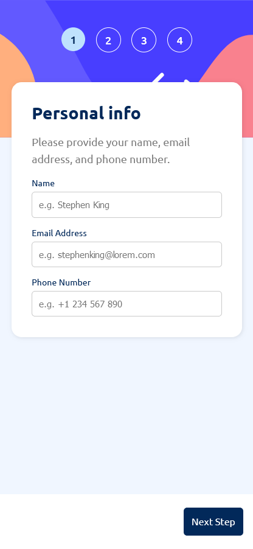

## Visão Geral

### O desafio

Os usuários devem ser capazes de:

- Completar cada etapa da sequência
- Voltar para uma etapa anterior para atualizar suas seleções
- Ver um resumo de suas seleções na etapa final e confirmar seu pedido
- Visualizar o layout ideal para a interface, dependendo do tamanho da tela do seu dispositivo
- Ver estados de hover e focus para todos os elementos interativos na página
- Receber mensagens de validação do formulário se:
  - Um campo foi deixado em branco
  - O endereço de e-mail não estiver formatado corretamente
  - Uma etapa for enviada, mas nenhuma seleção foi feita

### Imagens

### Links

- URL da solução: [Solução](https://your-solution-url.com)
- URL do site: [Vercel](https://form-challenge-three.vercel.app)

## Meu Processo

### Construído com

- Propriedades personalizadas em CSS
- Flexbox
- CSS Grid
- Fluxo de trabalho "Mobile-first"
- [React](https://reactjs.org/) - Biblioteca JS
- [Sass](https://sass-lang.com/) - Pré-processador CSS

### O que aprendi

#### Sass

Foi o meu primeiro projeto utilizando o Sass, e confesso que nesse projeto em específico, não percebi muita diferença na velocidade de desenvolvimento. 
Embora a tecnologia disponibilize alguns recursos que melhorem a legibilidade do arquivo de estilos (Como a definição dos filhos como atributo do elemento pai entre as chaves), 
a complexidade do código não foi diminuída. Talvez por eu não ter utilizado em abrangência os **@mixins** ou o **@extend**, eu tenha tido essa impressão. 
Entretanto, creio que utiliza-lo em conjunto com o **Tailwind** possa acelerar, e muito, o desenvolvimento de páginas responsivas.

### Desenvolvimento Contínuo

Pretendo me aperfeiçoar mais em diminuir a complexidade dos meus arquivos de estilos, e estudar mais afundo o Sass para aplica-lo melhor em futuros projetos.

### Recursos úteis

- [Curso de SASS](https://cursos.alura.com.br/course/sass-css-estilizando-site) - Esse curso me auxiliou no meu aprendizado com Sass.

## Autor

- Frontend Mentor - [@JuanGabriel-SA](https://www.frontendmentor.io/profile/JuanGabriel-SA)
- Linkedin - [@juan-gabriel-sa](https://www.linkedin.com/in/juan-gabriel-sa/)
